:::::::::::::::::::::::::::::::::::::::::::::::: callout

### Dataverse extension: case study

This is outside the six-episode public core. Operational commands and historical
status descriptions are examples for analysis, not a current production runbook.
No AWS or private access is required to discuss the included material. Only
authorized maintainers using a reviewed, current runbook should operate the
actual service. Do not run these commands as workshop exercises.

::::::::::::::::::::::::::::::::::::::::::::::::

:::::::::::::::::::::::::::::::::::::: questions

- What is this lesson and who is it for?
- What infrastructure does Dataverse need to run?
- How are Terraform, Ansible, and the Dataverse application connected?

::::::::::::::::::::::::::::::::::::::::::::::::

::::::::::::::::::::::::::::::::::::: objectives

- Describe the UCLA Dataverse infrastructure stack and what each component does.
- Explain the division of responsibility between Terraform and Ansible.
- Navigate the three repositories that make up this infrastructure.
- Explain what the 5.14 to 6.8 migration involved and why it shaped these decisions.

::::::::::::::::::::::::::::::::::::::::::::::::

## From the public core to Dataverse

The [public core](../index.md) uses Potree and Ansible to practice desired state,
verification, diagnosis, and local rollback without AWS credentials. This
extension transfers those habits to Dataverse, where application state, metadata,
file storage, and external identifiers make recovery more demanding.

The following architecture and repository descriptions capture the historical
5.14-to-6.x migration context. Version and roadmap status are historical evidence,
not a claim about today's production deployment. Public learners can analyze the
included diagrams and excerpts; private exploration is optional for maintainers.

## The stack at a glance

Running Dataverse requires several components working together:

{alt='Architecture diagram: a browser/user on the internet sends a request into an AWS box containing an EC2 instance running Apache httpd (reverse proxy and SSL termination), which forwards to Payara running the Dataverse WAR file, which talks to Solr for search. Payara also connects out to RDS PostgreSQL for metadata and S3 for file storage, both outside the EC2 instance.'}

**EC2** is a virtual machine running Rocky Linux 9. Payara, Solr, and Apache all run here.

**RDS** is a managed PostgreSQL database hosted by AWS. Dataverse stores all its metadata here:
datasets, files, users, permissions, version histories. The database is the source of truth
for everything except the actual file content.

**S3** is object storage for the data files that users upload. Dataverse stores file metadata in RDS
and file content in S3. The two must stay in sync: a file record in the database pointing to a
missing S3 object is a broken dataset.

**Payara** is a Jakarta EE application server. Dataverse runs as a WAR (Web Application Archive)
file deployed inside Payara, similar to how a web application runs inside Tomcat but targeting the
Jakarta EE ecosystem. Most Dataverse configuration is applied via Payara JVM options
or through the Dataverse API at first boot.

**Solr** is a search engine that powers Dataverse's dataset and file search. It maintains its own
index independently of the database. After any database restore, the Solr index must be explicitly
rebuilt; it will not update itself. A running Dataverse with a stale or empty Solr index will
appear to have no datasets.

**Apache httpd** acts as a reverse proxy in front of Payara and handles SSL termination. Requests
from browsers hit Apache first, then are forwarded to Payara on a non-public port. Apache also
handles URL rewriting and HTTP to HTTPS redirects.

## The three repositories

This infrastructure is managed across three repositories:

| Repository | What it does |
|---|---|
| `terraform-dataverse` | Provisions AWS resources: EC2, RDS, S3, security groups, Elastic IP, IAM roles |
| `dataverse-ansible` | Configures the EC2 instance: installs and configures Payara, Solr, Apache, and Dataverse |
| `dataverse-infrastructure` | Makefile targets, tests, baseline scripts, and runbooks that tie the other two together |

These map onto two concerns:

- **Infrastructure** (Terraform): what AWS resources exist and how they are connected
- **Configuration** (Ansible): what software is installed on those resources and how it is configured

You run Terraform first to provision the resources, then Ansible to configure them. The
`dataverse-infrastructure` repo is where you do both: its Makefile calls out to Terraform
and Ansible, so you rarely interact with either tool directly.

## Why infrastructure as code

Before Terraform and Ansible, changes to the Dataverse environment meant clicking through the
AWS console or running commands directly on the server by hand. That works until something breaks:

- You cannot reproduce exactly what you did
- The next person does not know what state the server is in
- Rebuilding from scratch after a failure is slow and depends on memory

Infrastructure as code puts the desired state of the system in version-controlled files.
Terraform describes what AWS resources should exist. Ansible describes what should be installed
and how it should be configured. Running them again should produce the same result. This property
is called **idempotency**, and it is one of the central ideas in [Ansible idempotency](ansible-idempotency.md).

## The migration context

This lesson was developed during the migration of the UCLA Library Dataverse instance from
version 5.14 to 6.8. Several decisions in the codebase (the Makefile targets, the baseline
scripts, the FAKE DOI provider configuration, the 7-phase migration plan) exist because of
constraints the migration imposed.

Later episodes explain why those decisions were made where they come up.
The migration itself is the subject of the final episode.

::::::::::::::::::::::::::::::::::::: challenge

### Take stock

Using the repository table and stack diagram above, match each requirement to
its repository: create an RDS instance, configure Payara, and orchestrate a
restore. Explain the dependency order.

Authorized maintainers may also inspect the current private repositories and
compare their entry points with the historical paths below. Access is not
required to complete this exercise.

:::::::::::::::::::::::::::::::::: solution

Some things to look for:

- `terraform-dataverse`: `environments/tim/main.tf` or `environments/jamie/main.tf` for the per-operator Terraform config
- `dataverse-ansible`: `site.yml` for the role entry point (the whole repo is treated as one Ansible role); `group_vars/` for environment-specific configuration
- `dataverse-infrastructure`: `Makefile` for the operations entry point; `scripts/baseline-capture.sh` for the baseline tooling

::::::::::::::::::::::::::::::::::::::::::

:::::::::::::::::::::::::::::::::::::::::::::::::

::::::::::::::::::::::::::::::::::::: challenge

### Who owns what

Without looking back at the table above, answer from memory:

1. If a dataset's files return a 404 because an S3 bucket policy is wrong, which repo do you fix?
2. If Solr comes up with an empty index after a database restore, which repo (or manual step) is responsible for rebuilding it, and why doesn't it happen automatically?

:::::::::::::::::::::::::::::::::: solution

1. `terraform-dataverse`: bucket policy and IAM are AWS resources, which is Terraform's domain, not Ansible's.
2. Neither repo does it automatically. Solr's index is built from what's in RDS, and Solr has no way to know the database changed underneath it. Rebuilding is a separate, explicit step (`make reindex` in `dataverse-infrastructure`) that must be run after any restore. See [Dataverse stack](dataverse-stack.md).

::::::::::::::::::::::::::::::::::::::::::

:::::::::::::::::::::::::::::::::::::::::::::::::

::::::::::::::::::::::::::::::::::::: keypoints

- Dataverse needs five components: Payara (app server), Solr (search), PostgreSQL via RDS (metadata), S3 (file content), Apache (proxy and SSL).
- Terraform provisions the AWS infrastructure; Ansible configures what runs on it.
- The three repos are `terraform-dataverse`, `dataverse-ansible`, and `dataverse-infrastructure`.
- Infrastructure as code makes the system reproducible, reviewable, and rebuildable.
- Many decisions in this codebase were shaped by the 5.14 to 6.8 migration, and that context appears throughout the lesson.

::::::::::::::::::::::::::::::::::::::::::::::::
