:::::::::::::::::::::::::::::::::::::: questions

- What actually happens between typing a URL and seeing a 3D scan?
- Which part of the system is responsible for each step?
- When a scan doesn't load, how do you tell where it broke?

::::::::::::::::::::::::::::::::::::::::::::::::

::::::::::::::::::::::::::::::::::::: objectives

- Trace a point cloud request from the browser through Apache to S3.
- Use `curl` to check each step on its own and read the status codes.
- Locate where a failure happens using evidence rather than guesses.

::::::::::::::::::::::::::::::::::::::::::::::::

## A smaller system first

The second half of this lesson covers Dataverse, which runs an application server, a search engine, a database and object storage. That's a lot to hold in your head while also learning what Ansible and Terraform do. So we start with a much smaller service built the same way: [pointcloud.ucla.edu](https://www.pointcloud.ucla.edu/), the UCLA Library Data Science Center's viewer for 3D scans.

Everything about it is in a public repository, [pointcloud-infra](https://github.com/ucla-data-science-center/pointcloud-infra): the Terraform that builds the server, the Ansible role that configures it, and the collection pages it serves. You can read all of it, and in the next episode you'll run it on your own laptop.

Before writing any automation, you need a picture of what the system *does*. This episode builds that picture by following one request. You only need a terminal with `curl`.

## The pieces

{alt="Request flow: a browser asks Apache on the EC2 server for a collection page; Apache returns the HTML plus Potree's JavaScript from the same server; the Potree viewer running in the browser then requests the point cloud data directly from an S3 bucket, sending the page's address in the Referer header; S3 returns the data only if that Referer is the www site."}

1. **Your browser** asks `https://www.pointcloud.ucla.edu/` for a collection page.
2. **Apache**, on one EC2 server, returns the page and the Potree viewer's JavaScript (`/build/potree/potree.js`).
3. **The Potree viewer**, now running *in your browser*, requests the point cloud data straight from **an S3 bucket**. The server never touches the 3D data.
4. **S3** checks the request's `Referer` header (the page it came from) and serves the data only to pages on `www.pointcloud.ucla.edu`. This deters ordinary hotlinking. It is not robust authentication or access control: a client can supply the header, as this exercise demonstrates.

Three systems, three places to fail.

::::::::::::::::::::::::::::::::::::: callout

### These commands depend on the live site

The outputs below were captured on 2026-10-04 against the real site. The S3 bucket's access rule, the redirects, and even which collection pages exist can change. If a command here gives a different result, don't assume you've done something wrong: check the repository's `docs/` and recent pull requests for what changed, and treat the difference as something to explain. That's good practice for the exam too, since you'll often meet systems that don't match the instructions.

::::::::::::::::::::::::::::::::::::::::::::::::

## Step 1: the page

```bash
curl -s -o /dev/null -w "%{http_code}\n" https://www.pointcloud.ucla.edu/Iceland/Torfljar.html
```

```output
200
```

`200` means Apache found the page and returned it. `-o /dev/null` throws the body away and `-w` prints just the status code.

## Step 2: the viewer code

Collection pages load Potree with relative paths. Look for them:

```bash
curl -s https://www.pointcloud.ucla.edu/Iceland/Torfljar.html | grep -o '\.\./build/[^"]*'
```

```output
../build/potree/potree.css
../build/potree/potree.js
```

```bash
curl -s -o /dev/null -w "%{http_code}\n" https://www.pointcloud.ucla.edu/build/potree/potree.js
```

```output
200
```

## Step 3: the data

Find where this page gets its point cloud:

```bash
curl -s https://www.pointcloud.ucla.edu/Iceland/Torfljar.html | grep -o 'loadPointCloud("[^"]*'
```

That prints a URL in an S3 bucket ending in `metadata.json`. Save it in a variable, then request it the way `curl` does by default, with no `Referer`:

```bash
DATA=$(curl -s https://www.pointcloud.ucla.edu/Iceland/Torfljar.html | grep -o 'loadPointCloud("[^"]*' | cut -d'"' -f2)
curl -s -o /dev/null -w "%{http_code}\n" "$DATA"
```

```output
403
```

::::::::::::::::::::::::::::::::::::: challenge

### Predict, then check

S3 refused. Before running anything else, write down:

1. What do you think a browser sends that `curl` didn't?
2. What status code will you get if you send it?

Then try it:

```bash
curl -s -o /dev/null -w "%{http_code}\n" \
  -H "Referer: https://www.pointcloud.ucla.edu/Iceland/Torfljar.html" "$DATA"
```

:::::::::::::::::::::::::::::::::: solution

A browser sends a `Referer` header naming the page that made the request. With it, S3 returns `200`. The bucket policy allows reads only when the `Referer` matches `https://www.pointcloud.ucla.edu/*`. Without it, you get `403 Forbidden`, which is exactly what a viewer page on the wrong address would see.

::::::::::::::::::::::::::::::::::::::::::

:::::::::::::::::::::::::::::::::::::::::::::::::

A browser's Referer may contain only the origin, depending on its referrer policy. The header is client-controlled and must never be treated as user identity.

## A real failure: the missing `www`

The site answers to two names, `www.pointcloud.ucla.edu` and `pointcloud.ucla.edu`. Until October 2026, a visitor arriving at `https://pointcloud.ucla.edu/...` got the page with a `200`, the viewer loaded, and then the scan never appeared. Every check that looked only at the page said the site was fine.

::::::::::::::::::::::::::::::::::::: challenge

### Where did it break?

Using only what you've seen in this episode, explain why the scan failed for visitors on `https://pointcloud.ucla.edu/` (no `www`). Which of the three systems refused, and why?

:::::::::::::::::::::::::::::::::: solution

The page came from `pointcloud.ucla.edu`, so the viewer's request to S3 carried `Referer: https://pointcloud.ucla.edu/...`. The bucket policy only allows `https://www.pointcloud.ucla.edu/*`, so S3 returned `403`. Apache and the page were fine. The failure was in step 3, caused by a decision made in step 1 (serving the page on the bare name). Modern browsers make this common, because they try `https://` first when you type a bare name.

::::::::::::::::::::::::::::::::::::::::::

:::::::::::::::::::::::::::::::::::::::::::::::::

The fix was to make Apache redirect every non-`www` address to `www`. Check it:

```bash
curl -s -o /dev/null -w "%{http_code} %{redirect_url}\n" https://pointcloud.ucla.edu/Iceland/Torfljar.html
```

```output
301 https://www.pointcloud.ucla.edu/Iceland/Torfljar.html
```

That redirect now lives in the Ansible role (`potree_canonical_redirect`), so a rebuilt server can't lose it.

::::::::::::::::::::::::::::::::::::: callout

### "The page loads" is not "the site works"

The repository's `scripts/site-check.sh` checks a 200 status for the canonical homepage, an exact 301 redirect for the chosen collection path, extraction of the first HTTPS `loadPointCloud` URL from that page, and a 200 response for that metadata URL with a supplied `Referer`. It also checks certificate expiry on both hostnames against a threshold (21 days by default). It does not parse the metadata or fetch the cloud's binary data, execute JavaScript, or prove browser rendering. Its first version only checked that both names returned `200` or `301`, and it would have passed during the outage above. When you write a check, ask what failure it would actually catch.

::::::::::::::::::::::::::::::::::::::::::::::::

::::::::::::::::::::::::::::::::::::: challenge

### Green checks, broken viewer?

If every `site-check.sh` check passes, what could still be broken? Name two
failures and the additional evidence you would gather.

:::::::::::::::::::::::::::::::::: solution

JavaScript could fail at runtime, a binary object could be missing, or CORS could
prevent browser access even though curl gets 200. Inspect the browser console
and network requests, including metadata and binary responses, then confirm an
actual scan renders. An HTTP status is not evidence of those later steps.

::::::::::::::::::::::::::::::::::::::::::

:::::::::::::::::::::::::::::::::::::::::::::::::

::::::::::::::::::::::::::::::::::::: challenge

### Map failures to places

For each symptom, say which step (page, viewer code, or data) you'd check first, and which `curl` command from this episode you'd run.

1. The browser shows "This site can't be reached."
2. The page loads but the viewer area is blank and the browser console shows `potree.js` 404.
3. The viewer and its controls appear, but no points ever load.

:::::::::::::::::::::::::::::::::: solution

1. Step 1, the page: `curl -s -o /dev/null -w "%{http_code}\n" https://www.pointcloud.ucla.edu/`. A connection error rather than a status code means the server or network is down, or the certificate is broken.
2. Step 2, the viewer code: request `/build/potree/potree.js` directly. A 404 means Potree isn't installed where the pages expect it.
3. Step 3, the data: extract the `loadPointCloud` URL and request it with the page as `Referer`. A 403 points to the bucket policy or the address the page was served from; a 404 means the data path in the page is wrong.

::::::::::::::::::::::::::::::::::::::::::

:::::::::::::::::::::::::::::::::::::::::::::::::

::::::::::::::::::::::::::::::::::::: keypoints

- A point cloud page involves three systems: Apache serves the page and viewer code, the viewer runs in the browser, and S3 serves the data directly to the browser.
- `curl` with `-o /dev/null -w "%{http_code}"` checks one step at a time; adding `-H "Referer: ..."` reproduces what a browser sends.
- Find where a failure happens from evidence first; the fix often belongs somewhere other than where the symptom appears.
- A health check is only as good as the failures it would catch.

::::::::::::::::::::::::::::::::::::::::::::::::
